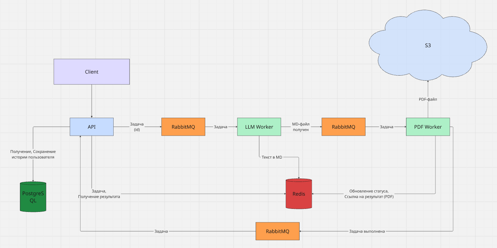
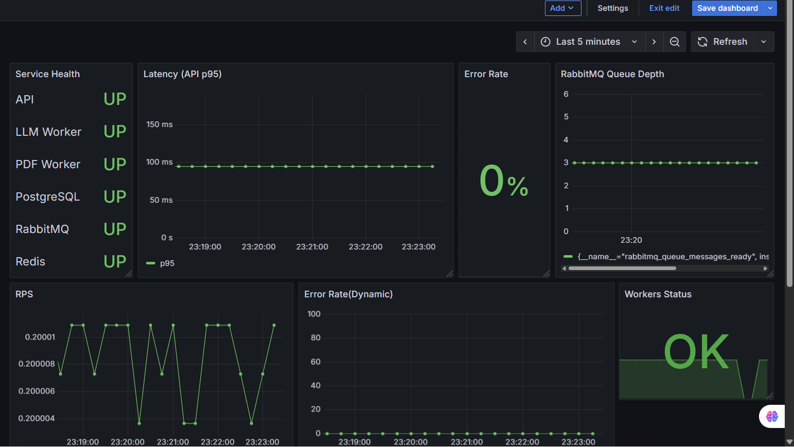

# TextCanvas

Сервис для генерации PDF-файлов из исходного текста. API принимает задачи, LLM worker генерирует текст, PDF worker рендерит документ и сохраняет в S3. Состояние задач хранится в Redis, пользователи и история задач в PostgreSQL, обмен между сервисами через RabbitMQ. Есть метрики Prometheus и дашборды Grafana.

---
## Структура

- `task-api` — FastAPI, аутентификация, задачи, отдача статусов.
- `llm-worker` — генерация структурированного текста через LLM(Yandex Cloud).
- `pdf-worker` — рендер Markdown → PDF и загрузка в S3.
- `shared` — общие модели, брокер, Redis-клиенты.
- observability — Prometheus, Grafana, Loki, Promtail, exporters.
---
## Быстрый старт (Docker)
1. Подготовьте env-файл:
`cp .env-example .env`
2. Заполните переменные в `.env` (ключи LLM и S3 обязательны для генерации PDF).
3. Сгенерируйте JWT ключи:
```bash
openssl genrsa -out task-api/src/certs/jwt-private.pem 2048
openssl rsa -in task-api/src/certs/jwt-private.pem -pubout -out task-api/src/certs/jwt-public.pem
```
4. Запустите сервисы:
`docker compose up --build`
5. Примените миграции:
`docker compose exec api alembic upgrade head`
---
## Брокер сообщений
- В проекте по RabbitMQ передаётся только id задачи, воркеры достают всю информацию о задаче из Redis
- Для сообщений реализован retry-механизм с помощью DLQ: при неудачной обработке воркером выполняются 3 повторные попытки с интервалом 60 секунд (можно настроить в config.py или .env). Если задача не выполняется, она переносится в очередь ошибочных сообщений.
---
## Мониторинг и метрики
- **Prometheus** — сбор метрик от всех сервисов
- **Grafana** — дашборды
- **Loki + Promtail** — централизованное логирование
- Exporters для PostgreSQL, Redis, RabbitMQ
---
Настроил Grafana-дашборды для мониторинга по 4 Golden Signals (latency, traffic, errors, saturation).

